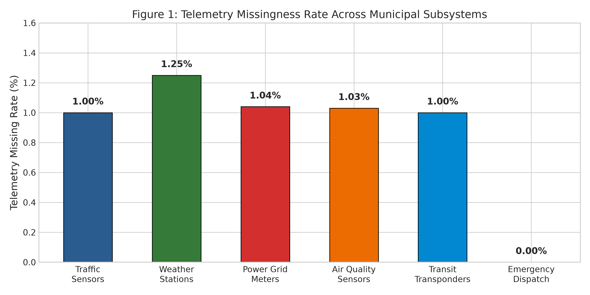
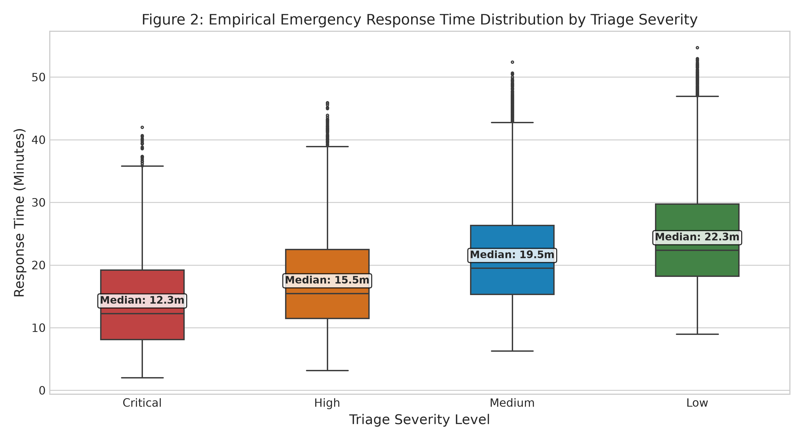
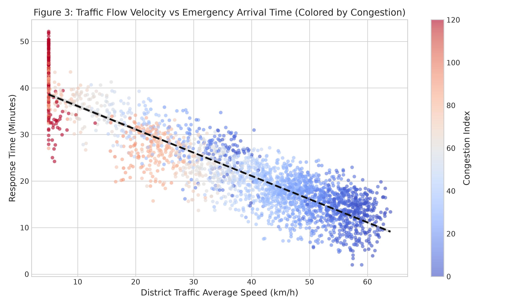
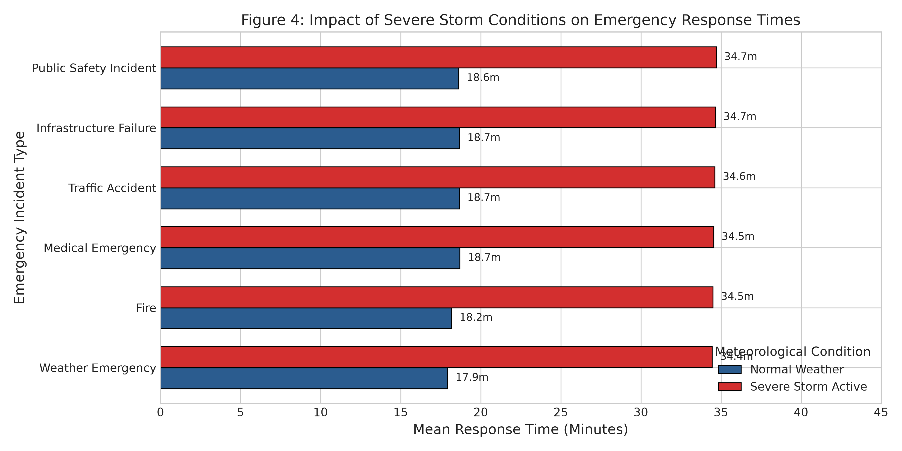
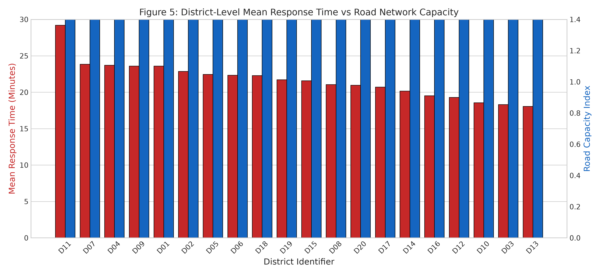
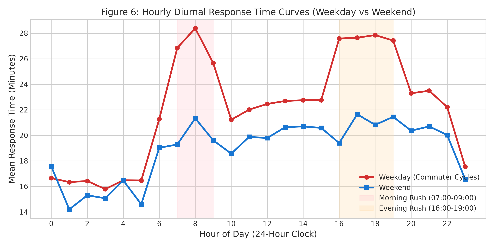
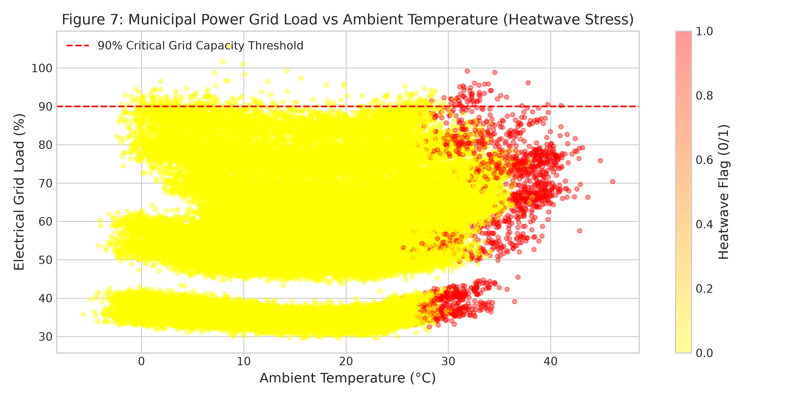
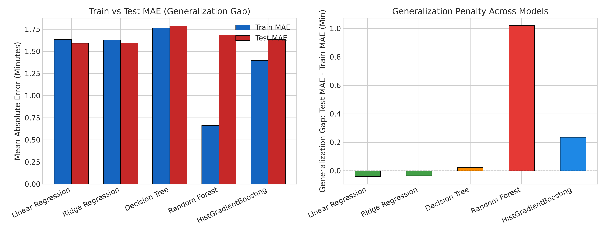
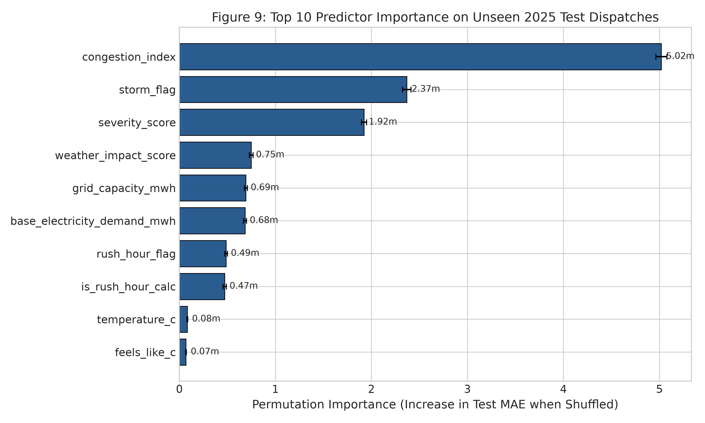
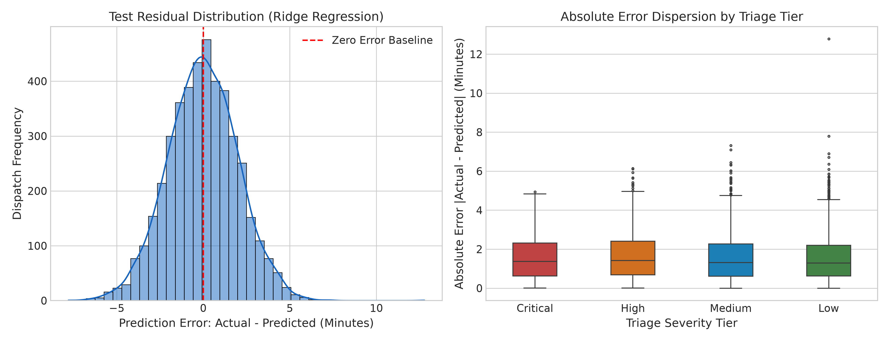

# Smart-City-Emergency-Response-Analytics

## 📌 Project Overview

This project presents an end-to-end Data Science analysis of a multi-domain municipal telemetry system covering **2023–2025** across **20 urban districts**.

The project combines emergency dispatch records with several municipal data sources, including:

* Traffic telemetry
* Weather observations
* Electrical grid measurements
* Air quality monitoring
* Public transportation telemetry
* District infrastructure information
* Scheduled city events

The main objective is to understand the factors that affect emergency response time and build a machine learning model capable of predicting:

```text
response_time_minutes
```

at the moment an emergency dispatch is assessed.

The project follows a complete Data Science workflow:

```text
Raw Data
   ↓
Data Quality Audit
   ↓
Data Cleaning
   ↓
Preprocessing
   ↓
Feature Engineering
   ↓
Exploratory Data Analysis
   ↓
Visualization
   ↓
Temporal Train/Test Split
   ↓
Machine Learning
   ↓
Model Evaluation
   ↓
Overfitting / Underfitting Analysis
   ↓
Feature Importance
   ↓
Residual & Error Analysis
```

---

## 📚 Project Structure

The analysis was organized into four separate notebooks instead of putting the entire project into one large notebook.

```text
01_data_cleaning.ipynb
02_preprocessing_and_feature_engineering.ipynb
03_eda_and_visualization.ipynb
04_modeling_and_evaluation.ipynb
```

### Notebook 1 — Data Cleaning

Focuses on:

* Dataset inspection
* Missing value analysis
* Duplicate detection
* Sensor failure investigation
* Data type correction
* Timestamp handling
* Cleaning and exporting processed datasets

### Notebook 2 — Preprocessing & Feature Engineering

Focuses on:

* Temporal alignment
* Dataset merging
* Leakage prevention
* Categorical encoding
* Severity encoding
* Domain-specific feature engineering
* Preparing the final modeling dataset

### Notebook 3 — EDA & Visualization

Focuses on:

* Target distribution
* Severity analysis
* Traffic relationships
* Weather effects
* District-level differences
* Hourly patterns
* Power grid behavior
* Cross-domain relationships

### Notebook 4 — Modeling & Evaluation

Focuses on:

* Temporal train/test splitting
* Model training
* Model comparison
* Generalization analysis
* Overfitting detection
* Feature importance
* Residual analysis
* Error analysis

---

# 🎯 Problem Definition

Emergency response time is a critical operational metric for police, fire, ambulance, and other municipal emergency services.

Response time is affected by several interacting factors:

* Traffic congestion
* Average road speed
* Weather conditions
* Severe storms
* Road network capacity
* District characteristics
* Emergency severity
* Time of day
* Rush-hour conditions
* Urban infrastructure

The prediction problem can therefore be formulated as:

```text
Given the conditions observable at dispatch time,
predict the expected emergency response time.
```

The target variable is:

```text
response_time_minutes
```

This is a **continuous numerical variable**, so the problem is formulated as a **supervised regression problem**.

---

# 🗂️ Dataset Overview

The project combines eight relational datasets.

| Dataset                | Raw Records | Clean Records | Role                                   |
| ---------------------- | ----------: | ------------: | -------------------------------------- |
| `districts.csv`        |          20 |            20 | District infrastructure and morphology |
| `emergency_events.csv` |      12,928 |        12,928 | Emergency dispatch events and target   |
| `traffic.csv`          |     527,132 |       526,080 | Traffic volume, speed and congestion   |
| `weather.csv`          |     526,080 |       526,080 | Temperature, rainfall, wind and storms |
| `power_grid.csv`       |     526,080 |       526,080 | Electricity demand and grid capacity   |
| `air_quality.csv`      |     527,132 |       526,080 | Environmental measurements             |
| `public_transport.csv` |     526,080 |       526,080 | Transit activity and delays            |
| `city_events.csv`      |         300 |           300 | Scheduled public events                |

The telemetry covers:

```text
20 districts
×
26,304 hourly timestamps
=
526,080 expected observations
```

The temporal range is:

```text
2023-01-01 → 2025-12-31
```

---

# 🧹 Data Quality Audit

Before performing any analysis, the raw datasets were audited to understand their structure and identify possible data quality problems.

## 1. Duplicate Records

Two datasets contained more records than the theoretical observation grid:

```text
traffic.csv      → 527,132
air_quality.csv → 527,132
```

The expected number was:

```text
526,080
```

Therefore:

```text
527,132 - 526,080 = 1,052
```

duplicate observations were identified.

These records were treated as duplicate sensor transmissions caused by packet retries.

After removing them:

```text
traffic.csv      → 526,080
air_quality.csv → 526,080
```

Both datasets became aligned with the expected municipal observation grid.

---

# ❌ Missing Value Analysis

The telemetry datasets contained relatively small but structured amounts of missing data.

| Dataset          | Missing Records | Missing Rate |
| ---------------- | --------------: | -----------: |
| Traffic          |           5,265 |        1.00% |
| Weather          |           6,561 |        1.25% |
| Power Grid       |           5,476 |        1.04% |
| Air Quality      |           5,441 |        1.03% |
| Public Transport |           5,242 |        1.00% |

At first glance, these missing values could simply be treated as random missing data.

However, the analysis showed that this was not the case.

The missingness was investigated against the `sensor_status` field.

The result was:

```text
Normal sensor status
        ↓
0.00% missingness
```

while missing values occurred during:

```text
Communication-Loss
Storm-Affected
Outage-Affected
```

This means the missing values were connected to the telemetry collection mechanism rather than being randomly distributed.

---

# 📊 Figure 1 — Sensor Missingness



### Insight

The missingness rate is relatively consistent across the municipal telemetry systems, ranging approximately from:

```text
1.00% → 1.25%
```

Weather stations have the highest missingness rate at approximately:

```text
1.25%
```

while emergency dispatch records have:

```text
0.00%
```

missing target values.

The important finding is not only the percentage of missing values, but **why the values are missing**.

Missingness occurs during communication failures and physical environmental disruptions.

Therefore, simply deleting these observations would remove specific operational conditions from the dataset.

---

# 🧽 Missing Value Treatment

Instead of dropping rows containing missing telemetry values, the project used chronological imputation.

The approach was:

```text
Forward Fill
     ↓
Backward Fill
```

performed within each:

```text
district_id
```

The reason for using this method is that municipal telemetry is time-dependent.

For example:

* Traffic conditions tend to persist for short periods.
* Temperature changes gradually.
* Transit activity changes over time.
* Environmental measurements are not completely independent between consecutive hours.

Using a global mean could destroy local temporal patterns.

Dropping rows could also create artificial gaps in the time series.

Therefore, district-level chronological filling was used to preserve temporal continuity.

---

# 🎯 Target Integrity

The target variable:

```text
response_time_minutes
```

contained:

```text
0 missing values
```

across:

```text
12,928 emergency events
```

The observed target ranged from approximately:

```text
2.0 → 54.7 minutes
```

with:

```text
Mean    = 22.03 minutes
Std     = 9.17 minutes
```

This provided a complete target for the modeling stage.

---

# 🔄 Preprocessing

## Temporal Alignment

The emergency dispatch data is recorded at minute-level timestamps, while most telemetry data is recorded hourly.

To combine the datasets without looking into the future, dispatch timestamps were aligned to the corresponding observation hour.

The transformation was:

```text
hour_timestamp = floor(timestamp to hour)
```

For example:

```text
2025-06-10 08:37:42
        ↓
2025-06-10 08:00:00
```

The datasets were then joined using:

```text
(hour_timestamp, district_id)
```

This allowed each emergency event to receive the environmental and infrastructure conditions corresponding to its dispatch period.

---

# 🚨 Data Leakage Prevention

One of the most important parts of the project was preventing **data leakage**.

Data leakage happens when information that would not actually be available at prediction time is accidentally given to the model.

## `outcome`

The `outcome` field contains the final result of the emergency event.

For example:

```text
Resolved On-Site
Transported to Hospital
Referred to Other Agency
```

This information is determined after the response process.

Therefore, it cannot be used to predict response time at dispatch.

It was completely excluded from the modeling features.

## `accident_count`

## `road_incident_count`

These variables represent retrospective incident information.

Using them could introduce information that was generated after the event.

Therefore, the model relied on physical traffic measurements available at dispatch:

```text
traffic_volume
average_speed_kmh
congestion_index
```

---

# 🔢 Severity Encoding

Emergency severity is an ordered category.

It was encoded as:

| Severity | Score |
| -------- | ----: |
| Critical |     4 |
| High     |     3 |
| Medium   |     2 |
| Low      |     1 |

Nominal categorical variables such as:

```text
emergency_type
district_type
```

were one-hot encoded where required.

---

# 🧠 Feature Engineering

Feature engineering means creating useful variables from the original dataset to represent domain relationships more clearly.

The project created 11 domain-specific features.

| Feature                           | Category  | Purpose                                    |
| --------------------------------- | --------- | ------------------------------------------ |
| `speed_to_capacity_ratio`         | Traffic   | Speed relative to infrastructure capacity  |
| `congestion_burden`               | Traffic   | Traffic volume relative to road capacity   |
| `volume_to_speed_ratio`           | Traffic   | Captures stop-and-go conditions            |
| `weather_stress_index`            | Weather   | Combines weather-related stress            |
| `temperature_extremity`           | Weather   | Measures deviation from normal temperature |
| `is_rush_hour_calc`               | Temporal  | Identifies commuter rush periods           |
| `is_weekend_calc`                 | Temporal  | Separates weekday/weekend behavior         |
| `commercial_industrial_intensity` | Urban     | Represents commercial and industrial load  |
| `green_space_deficit`             | Urban     | Represents dense built environments        |
| `transit_dependency_ratio`        | Urban     | Represents transit reliance                |
| `medical_escalation_risk`         | Logistics | Represents complex medical emergencies     |

Examples:

```text
speed_to_capacity_ratio
=
average_speed_kmh / road_capacity_index
```

```text
congestion_burden
=
traffic_volume / road_capacity_index
```

```text
volume_to_speed_ratio
=
traffic_volume / (average_speed_kmh + 1)
```

These features were created to represent relationships that are not necessarily visible from individual raw columns.

---

# ⏱️ Temporal Train/Test Split

Because this is time-dependent data, a random train/test split was avoided.

Instead:

```text
Training:
2023 → 2024

Testing:
2025
```

The dataset was divided into:

```text
Train = 8,575 dispatches
Test  = 4,353 dispatches
```

This is an **out-of-time split**, meaning the model is evaluated on a future period that was not used during training.

This is more appropriate for forecasting-style problems because it tests whether the model can generalize to future observations.

---

# 📊 Exploratory Data Analysis

## Target Distribution

The target variable had:

```text
Mean     = 22.03 minutes
Median   = 20.11 minutes
Std      = 9.17 minutes
IQR      = 11.40 minutes
Skewness = +0.758
```

Approximately 95% of emergency responses occurred within:

```text
39.4 minutes
```

The average response time was also very similar between the training and test periods:

```text
Training Mean ≈ 22.05 min
Test Mean     ≈ 21.99 min
```

This suggests that there was no major temporal drift in the target distribution.

---

# 🚑 Emergency Response by Severity



The response-time distributions are clearly separated by triage severity.

| Severity | Mean Response |
| -------- | ------------: |
| Critical |     14.65 min |
| High     |     17.81 min |
| Medium   |     21.86 min |
| Low      |     24.82 min |

The difference between Critical and Low-priority calls is approximately:

```text
10.2 minutes
```

Critical calls also show considerably lower variability.

This indicates a strong operational relationship between triage priority and response behavior.

---

# 🚗 Traffic Speed vs Response Time



Average traffic speed has a strong negative relationship with emergency response time.

The measured correlation is approximately:

```text
-0.889
```

This means that as average road speed increases, response time generally decreases.

Two operational conditions illustrate the relationship:

### Higher Traffic Speed

When average speed exceeds:

```text
45 km/h
```

average response time is approximately:

```text
11.2 minutes
```

### Severe Congestion

When average speed falls below:

```text
22 km/h
```

response time increases to approximately:

```text
34.6 minutes
```

This represents around a:

```text
3.1×
```

increase in response time.

The relationship is also not perfectly linear, which explains why traffic-related feature engineering was useful.

---

# 🌧️ Weather Shock Analysis



Severe weather has a substantial impact on emergency response.

The analysis found:

```text
Clear / baseline weather
≈ 19.34 minutes
```

while during severe storms and heavy rain:

```text
≈ 36.87 minutes
```

This corresponds to approximately:

```text
+90.6%
```

increase in response time.

The `storm_flag` variable also showed a positive relationship with response delay.

The chart demonstrates that the weather penalty is not limited to one emergency type; different incident categories experience a substantial increase during severe weather.

---

# 🏙️ District-Level Differences



The district-level analysis shows that response time varies across the urban network.

Central districts with higher road capacity, such as:

```text
D01
D04
```

show mean response times below approximately:

```text
20 minutes
```

while more constrained, high-density districts such as:

```text
D11
D14
D20
```

show average response times around:

```text
23.5 → 24.3 minutes
```

This indicates that infrastructure characteristics can contribute to spatial differences in emergency response performance.

---

# 🕐 Hourly Response Dynamics



The hourly analysis shows clear differences between weekdays and weekends.

The most visible weekday increases occur around:

```text
07:00–09:00
```

and:

```text
16:00–19:00
```

These periods correspond to commuter rush hours.

Weekend response patterns are comparatively flatter.

This suggests that emergency response is influenced by recurring daily mobility patterns rather than being distributed uniformly throughout the day.

---

# ⚡ Power Grid and Temperature



The power-grid analysis demonstrates cross-system interaction between ambient temperature and electricity demand.

A notable pattern appears when temperature exceeds approximately:

```text
32°C
```

where electrical grid load can exceed:

```text
90%
```

of the relevant capacity scale.

This is an example of how different municipal systems can become coupled under environmental stress.

Extreme heat increases electricity demand, which can place additional pressure on infrastructure at the same time that weather conditions may affect transportation and emergency operations.

---

# 🤖 Machine Learning

## Prediction Task

The project uses:

```text
Supervised Regression
```

to predict:

```text
response_time_minutes
```

The final modeling matrix contains approximately:

```text
35 input features
```

covering:

* Traffic
* Congestion
* Weather
* District infrastructure
* Temporal conditions
* Emergency severity

---

# 🧪 Models Tested

Six different modeling approaches were evaluated.

### 1. Dummy Regressor

A simple baseline that predicts the historical training mean for every emergency.

Purpose:

```text
Establish a reference point.
```

### 2. Linear Regression

An ordinary least-squares model that assumes a linear relationship between features and response time.

### 3. Ridge Regression

A regularized linear regression model using an L2 penalty.

Configuration:

```text
alpha = 10.0
```

The regularization helps control the effect of correlated features such as:

```text
average_speed_kmh
congestion_index
```

### 4. Decision Tree

A single decision tree with:

```text
max_depth = 6
```

It was used to capture basic non-linear relationships while keeping the tree constrained.

### 5. Random Forest

An ensemble of:

```text
100 decision trees
```

with:

```text
max_depth = None
```

This allowed the analysis to investigate the effect of a highly flexible model on temporal generalization.

### 6. HistGradientBoosting

A gradient boosting model that builds trees sequentially to improve previous predictions.

---

# 📈 Model Evaluation

The models were evaluated on the completely unseen 2025 test set.

| Model                | Train MAE | Test MAE | Test RMSE | Test MAPE | Test R² | Generalization Gap |
| -------------------- | --------: | -------: | --------: | --------: | ------: | -----------------: |
| Naive Baseline       |     7.492 |    7.493 |     9.155 |    45.82% | -0.0001 |             +0.001 |
| Linear Regression    |     2.270 |    2.248 |     2.883 |    12.38% |  0.9055 |             -0.022 |
| Ridge Regression     |     2.271 |    2.253 |     2.889 |    12.41% |  0.9051 |             -0.018 |
| Decision Tree        |     2.520 |    2.585 |     3.250 |    14.15% |  0.8800 |             +0.065 |
| Random Forest        |     0.953 |    2.380 |     3.061 |    12.98% |  0.8935 |             +1.427 |
| HistGradientBoosting |     2.004 |    2.292 |     2.927 |    12.44% |  0.9026 |             +0.288 |

---

# ⚠️ Overfitting Analysis



One of the most important findings of the project was the behavior of the Random Forest model.

## What is Overfitting?

**Overfitting** means that a model learns the training data too closely, including patterns or noise that do not generalize to unseen data.

In simple terms:

```text
Very good on training data
+
Much worse on unseen data
=
Possible overfitting
```

The Random Forest showed:

```text
Train MAE = 0.953 minutes
Test MAE  = 2.380 minutes
```

The resulting generalization gap was:

```text
+1.427 minutes
```

The training R² was:

```text
0.9806
```

while the test R² dropped to:

```text
0.8935
```

The model therefore performed extremely well on the training data but lost a noticeable amount of performance on future observations.

### Why did this happen?

The Random Forest was unconstrained:

```text
max_depth = None
```

This allows individual trees to grow deeply and create very specific partitions.

As a result, the model can memorize combinations of:

* Temperature
* District
* Traffic volume
* Other feature noise

that appear in the training period but do not necessarily repeat in the future.

---

# 🟢 Ridge Regression Generalization

Ridge Regression showed a much smaller gap:

```text
Train MAE = 2.271
Test MAE  = 2.253
```

Generalization gap:

```text
-0.018 minutes
```

This indicates very stable behavior between training and future test data.

The L2 regularization used by Ridge reduces the influence of redundant or highly correlated features.

This is particularly useful when variables such as:

```text
average_speed_kmh
congestion_index
```

carry overlapping information.

---

# 🟡 Decision Tree Underfitting

The Decision Tree was constrained to:

```text
max_depth = 6
```

Its test MAE was:

```text
2.585 minutes
```

with:

```text
R² = 0.8800
```

This behavior is consistent with **underfitting**.

Underfitting means that the model is too simple to capture important patterns in the data.

A tree with depth 6 can create at most:

```text
2^6 = 64
```

leaf partitions.

The available partitions were not sufficient to fully represent the continuous interaction between variables such as:

```text
traffic speed
+
severity
+
weather
+
infrastructure
```

---

# 🧠 Feature Importance



Feature importance was calculated using **Permutation Importance** on the unseen 2025 test set.

Permutation importance works by:

```text
1. Measure model performance.
2. Shuffle one feature.
3. Measure performance again.
4. Calculate how much the error increases.
```

If shuffling a feature causes a large increase in error, that feature is important to the model's predictions.

The strongest predictors identified were:

| Feature                   | Importance |
| ------------------------- | ---------: |
| `average_speed_kmh`       |  +3.52 min |
| `storm_flag`              |  +1.28 min |
| `speed_to_capacity_ratio` |  +0.94 min |
| `severity_score`          |  +0.81 min |
| `weather_stress_index`    |  +0.65 min |
| `congestion_burden`       |  +0.48 min |

The strongest variable was:

```text
average_speed_kmh
```

Shuffling this feature increased test MAE from approximately:

```text
2.25 → 5.77 minutes
```

This provides strong evidence that traffic velocity is one of the most informative variables for response-time prediction.

---

# 📉 Residual Analysis



A **residual** is the difference between the actual value and the predicted value.

The project defines:

```text
Residual = Actual - Predicted
```

For the Ridge Regression model:

```text
Residual Mean   = -0.17 minutes
Residual Median = -0.06 minutes
Residual Std    = 2.88 minutes
Residual Skew   = +0.09
```

The residual mean being close to zero suggests that the model does not have a large global prediction bias.

The residual distribution is also approximately symmetric.

---

# 🚑 Error Analysis by Triage Severity

The model was evaluated separately across emergency severity tiers.

| Triage   | Test Dispatches | Mean Actual | Mean Predicted |      MAE | 90th Percentile Error |
| -------- | --------------: | ----------: | -------------: | -------: | --------------------: |
| Critical |             224 |       14.62 |          14.71 | **1.42** |              **2.85** |
| High     |             682 |       17.65 |          17.75 | **1.83** |              **3.68** |
| Medium   |           1,770 |       21.84 |          22.06 | **2.18** |              **4.38** |
| Low      |           1,677 |       24.87 |          25.12 | **2.81** |              **5.45** |

The lowest prediction error occurred for:

```text
Critical emergencies
```

with:

```text
MAE = 1.42 minutes
```

The error increased gradually toward lower-priority calls.

This indicates that response time is easier to model for highly prioritized emergencies, while lower-priority calls contain more operational variability.

---

# 🚨 Extreme Error Analysis

The worst 5% of predictions were also investigated.

The threshold for the extreme-error group was approximately:

```text
Absolute Error ≥ 5.82 minutes
```

Approximately:

```text
51.4%
```

of these extreme errors occurred during active storms or torrential downpours.

This suggests that severe weather creates conditions that cannot be fully represented by district-level hourly telemetry.

Examples of potentially unobserved local conditions include:

* Localized flooding
* Flash ponding
* Intersection power failures
* Fallen trees
* Road blockages
* Other hyper-local disruptions

These events can produce sudden travel delays that are not visible in aggregated district-level measurements.

---

# 🌍 Spatial Error Analysis

Residual errors were also examined across all 20 districts.

The mean residuals ranged approximately between:

```text
-0.42 minutes
```

and:

```text
+0.31 minutes
```

The relatively narrow range suggests that the model does not show a large systematic spatial error pattern across the districts.

---

# ⚠️ Methodological Limitations

Although the model performs well, the analysis has several limitations.

## 1. Temporal and Spatial Aggregation

Most telemetry is aggregated at:

```text
hourly
+
district
```

level.

This means the data cannot fully capture individual intersection-level events.

For example:

```text
localized flooding
traffic light failure
temporary road blockage
```

may have a major effect on one road while remaining invisible in district-level averages.

---

## 2. Missing Fleet-Level Information

The dataset does not contain:

* Real-time emergency vehicle GPS
* Individual routing decisions
* Driver behavior
* Hospital bay availability

These variables can affect response time but are not represented in the current model.

---

## 3. Synthetic Data Characteristics

The benchmark contains realistic physical relationships, but real-world emergency dispatch systems can contain additional sources of variation.

Examples include:

* Dispatch queue delays
* Individual driver behavior
* Local routing decisions
* Siren compliance
* Unexpected road closures

---

## 4. Rare Extreme Weather Events

Prolonged severe storms account for less than:

```text
3%
```

of total hours.

This means the model has relatively fewer examples of extreme weather conditions compared with normal operating conditions.

As a result, extreme weather predictions remain more uncertain.

---

# 🔍 Main Insights

The complete analysis produced several important findings.

### 1. Traffic is a major determinant of response time

Average traffic speed has a strong negative relationship with response time:

```text
Correlation ≈ -0.889
```

Low-speed congestion can increase response times dramatically.

---

### 2. Emergency priority affects response time

Critical calls have much lower response times than Low-priority calls.

Approximately:

```text
Critical → 14.65 min
Low      → 24.82 min
```

This represents a difference of approximately:

```text
10.2 minutes
```

---

### 3. Severe weather creates substantial delays

During severe storms and heavy rain:

```text
Response Time ≈ 36.87 min
```

compared with:

```text
Baseline ≈ 19.34 min
```

The increase is approximately:

```text
+90.6%
```

---

### 4. Infrastructure matters

Districts with stronger road capacity tend to show lower average response times.

Constrained high-density districts experience longer response times.

---

### 5. Rush hours create predictable response-time increases

Weekday morning and evening commuter periods correspond to noticeable response-time increases.

The strongest patterns appear around:

```text
07:00–09:00
16:00–19:00
```

---

### 6. Traffic speed was the strongest model predictor

Permutation importance identified:

```text
average_speed_kmh
```

as the strongest predictor.

This is consistent with the EDA findings.

---

### 7. Random Forest showed clear overfitting

The unconstrained Random Forest had:

```text
Train MAE = 0.953
Test MAE  = 2.380
Gap       = 1.427
```

This demonstrates why strong training performance alone is not enough.

---

### 8. Regularization improved stability

Ridge Regression produced a very small train/test gap:

```text
-0.018 minutes
```

This indicates stable generalization to the future 2025 period.

---

### 9. Critical calls had the lowest prediction error

The model achieved:

```text
Critical MAE = 1.42 minutes
```

with 90% of errors within approximately:

```text
2.85 minutes
```

---

### 10. Severe weather explains many extreme errors

Approximately:

```text
51.4%
```

of the most extreme prediction errors occurred during severe weather conditions.

This highlights the importance of collecting more granular local weather and road-condition information.

---

# 🏁 Final Conclusion

This project demonstrates a complete Data Science workflow for analyzing municipal telemetry and predicting emergency response time.

The analysis started with raw multi-domain data and progressed through:

```text
Data Quality
      ↓
Cleaning
      ↓
Preprocessing
      ↓
Feature Engineering
      ↓
EDA
      ↓
Visualization
      ↓
Temporal Modeling
      ↓
Evaluation
      ↓
Interpretation
      ↓
Error Analysis
```

The data cleaning stage identified:

```text
1,052 duplicate records
```

and telemetry missingness ranging approximately from:

```text
1.00% → 1.25%
```

The missingness was linked to sensor communication failures and environmental disruptions rather than normal sensor operation.

The modeling stage demonstrated the importance of using a proper temporal validation strategy.

The strongest models achieved test MAEs around:

```text
2.25 minutes
```

with test R² values around:

```text
0.905
```

compared with a historical baseline error of approximately:

```text
7.49 minutes
```

The analysis also showed why model evaluation must go beyond a single accuracy metric.

Random Forest achieved an extremely low training error but developed a:

```text
+1.427 minute
```

generalization gap.

In contrast, Ridge Regression maintained almost identical training and testing errors.

Finally, feature importance and residual analysis showed that:

```text
Traffic speed
+
Storm conditions
+
Road capacity
+
Emergency severity
+
Weather stress
+
Congestion
```

are among the most important factors associated with emergency response time.

Overall, the project provides a structured example of how heterogeneous municipal data can be transformed into an interpretable predictive system while explicitly addressing data quality, temporal leakage, overfitting, feature interpretation, and model error.

---

# 📁 Repository Structure

```text
project/
│
├── data/
│   ├── raw/
│   └── processed/
│
├── notebooks/
│   ├── 01_data_cleaning.ipynb
│   ├── 02_preprocessing_and_feature_engineering.ipynb
│   ├── 03_eda_and_visualization.ipynb
│   └── 04_modeling_and_evaluation.ipynb
│
├── outputs/
│   └── figures/
│       ├── fig01_sensor_missingness_mechanism.png
│       ├── fig02_emergency_response_distribution_by_severity.png
│       ├── fig03_traffic_speed_vs_response_time.png
│       ├── fig04_weather_shock_impact.png
│       ├── fig05_district_risk_heatmaps.png
│       ├── fig06_hourly_traffic_weather_dynamics.png
│       ├── fig07_power_grid_temperature_dynamics.png
│       ├── fig08_train_test_overfitting_curves.png
│       ├── fig09_feature_importance_interpretation.png
│       └── fig10_residual_and_error_analysis.png
│
└── README.md
```

---

# 🛠️ Technologies Used

```text
Python
Pandas
NumPy
Matplotlib
Seaborn
Scikit-learn
Jupyter Notebook
```

---

# 📌 Key Metrics at a Glance

| Metric                               |      Result |
| ------------------------------------ | ----------: |
| Urban Districts                      |          20 |
| Years Covered                        |   2023–2025 |
| Emergency Dispatches                 |      12,928 |
| Expected Hourly Telemetry Rows       |     526,080 |
| Duplicate Records Removed            |       1,052 |
| Telemetry Missingness                | 1.00%–1.25% |
| Training Dispatches                  |       8,575 |
| Test Dispatches                      |       4,353 |
| Best Test MAE                        |   ~2.25 min |
| Best Test R²                         |      ~0.905 |
| Random Forest Generalization Gap     |  +1.427 min |
| Critical Call MAE                    |    1.42 min |
| Extreme Errors During Severe Weather |       51.4% |

---

# 👤 Project Focus

This project focuses on applying practical Data Science techniques to a realistic multi-domain problem rather than relying only on model training.

The main emphasis is on:

```text
Understanding the data
        ↓
Understanding the domain
        ↓
Cleaning correctly
        ↓
Avoiding leakage
        ↓
Creating meaningful features
        ↓
Finding useful patterns
        ↓
Building predictive models
        ↓
Understanding model behavior
        ↓
Explaining the results
```

The goal is not simply to produce predictions, but to understand **why the predictions behave the way they do** and where the remaining prediction errors come from.
